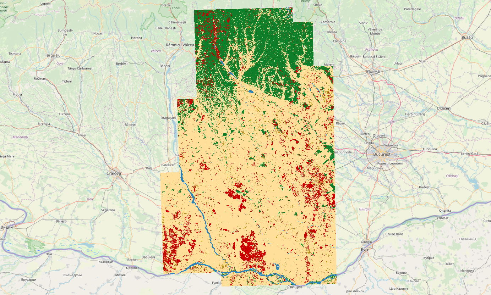

# FOSS4G 2019 - Earth Observation Challenge 

## Environment setup 

### Anaconda
to create an [Anaconda](https://www.anaconda.com/) environment for this project, you can run the following command:

```shell script
    conda env create --name NAME --file ENV_FILE
```

As an example of `ENV_FILE`, you can use the **[environment_py36_eoc.yml](./environment_py36_eoc.yml)** file which has been exported from a working environment with Python 3.6.

To create a new ENV file  or to update the current one use this command (while the source env is activated):

```shell script
    conda env export > ENV_FILE     
```

### Virtualenv

Install virtualenv:
```shell script
pip install virtualenv
```
Creating a virtual environment can be done by the command below. 
This wil generate a virtual environment for python in a defined directory (in this case .virtualenv): 
```shell script
virtualenv --python=python3 .virtualenv
```

Activate virtual environment:
```shell script
source .virtualenv/bin/activate
```

To install dependencies using pip and the requirements file:
```shell script
pip install -r requirements.txt
```

To leave the virtual environment:
```shell script
deactivate
```

## Git integration
Since generally Jupyter Notebook changes contain a lot of noise, it's hard to track the actual differences in Git (for a more detailed description of the problem as well as a few solution out there see [this page](https://nextjournal.com/schmudde/how-to-version-control-jupyter)).

To make things a bit simpler, before each commit to Git, two extra steps can be taken:
* Clear the notebook output: this can be done in the IDE or from the terminal via, for example, the [nbstripout](https://github.com/kynan/nbstripout) module. 
* Generate/update the "pure" Python version of the notebook which is a lot easier to track changes in; the `Jupyter` tool itself comes with a handy command (i.e. `nbconvert`) for this purpose.

While these two steps can be run manually and separately, they can be both combined into a [pre-commit hook/script](https://githooks.com/)) which is automatically run by Git before each commit.
As an example, you can copy the **[pre-commit](./pre-commit)** file (main content shown below ) in this repository into the `.git/hooks` directory.

```shell script
    # clear the notebook output
    nbstripout eochallenge_notebook.ipynb
    # generate the "pure" Python version of the notebook
    jupyter nbconvert eochallenge_notebook.ipynb --to="python"
    # add the generated file to the staging area of Git
    git add eochallenge_notebook.py
```

## Run the land cover extraction



In order to run the workbench based on `eo-learn` and `sentinelhub-py`, you can run the following lines 
after cloning the repository and installing the dependencies:

- Run the full processing chain (input data preparation, model training and prediction):
```shell script
python eochallenge_notebook_full.py
```

- Run only the input data preparation:
```shell script
python eochallenge_notebook_prepare_data.py
```

- Interactively train the model, print the test results and run the prediction, run `jupyter lab`, 
open `eochallenge_notebook_train_predict.ipynb`, and run through the code blocks. 
_This part remains unfinished. It is advised to run the code with the `eochallenge_notebook_full.py`._

Once prediction has produced a collection of land cover TIFFs, the results can be stitched together and denoised using `GDAL` CLIs:
Romania 2018 example:
```shell script
# build a .VRT file with all independent TIFF files (potentially 100s)
gdalbuildvrt /home/ubuntu/output/2018/Romania/lulc_pred/pred_mosaic_romania_2018.vrt /home/ubuntu/output/2018/Romania/lulc_pred/pred*

# Sieve the output to denoise the pixel-based output with a 50 "pixel polygon" size threshold.
gdal_sieve.py -st 50 /home/ubuntu/output/2018/Romania/lulc_pred/pred_mosaic_romania_2018.vrt -of GTiff /home/ubuntu/output/2018/Romania/lulc_pred/pred_mosaic_romania_2018_s50.tif

# (optional) perform additional tiling and compressing
gdal_translate -q /home/ubuntu/output/2018/Romania/lulc_pred/pred_mosaic_romania_2018_s50.tif /home/ubuntu/output/2018/Romania/lulc_pred/pred_mosaic_romania_2018_s50_compress.tif -co COMPRESS=DEFLATE -co TILED=YES -co PREDICTOR=2
```

## Perform pixel-based change detection

The `eochallenge_change_detection_notebook.ipynb` can be run through to create a gif of the changed objects between the two years.

## Misc

The `sentinelhub` package currently does not support custom DataSources, to add that support for time being you'll need to use the [`contants.py`](./constants.py) and [`ogc.py`](./ogc.py) files to overwrite the original files in the package.

This repository is experimental and carried out in the context of the FOSS4G EO Challenge. Therefore, the `instance_id` used is specific to the project, so one would need to recreate their Sentinelhub environment with their respective `instance_id`.
